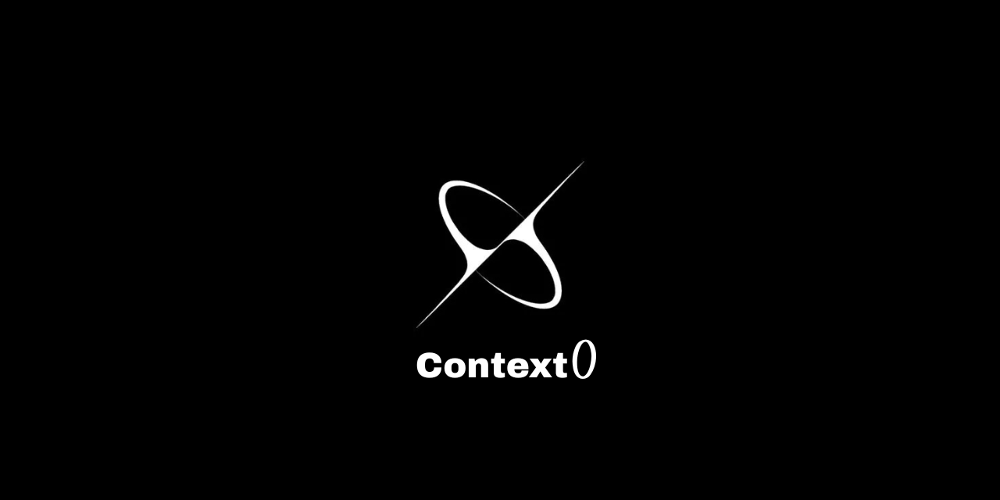

<h1 align="center">
  Context0 <br/>
  <span style="font-size: 20px; font-weight: normal;">
    The Future of AI Memory is Decentralized
  </span>
</h1>


<p align="center">
  
</p>

<p align="center">
  <a href="LICENSE"></a>
  <a href="https://www.typescriptlang.org/"></a>
  <a href="https://arweave.org"></a>
  <a href="https://github.com/Itz-Agasta/context0"></a>
  <a href="https://github.com/Itz-Agasta/context0"></a>
   <a href="LICENSE"></a>
  <a href="https://github.com/Itz-Agasta/context0/pulls"></a>
  <a href="https://github.com/Itz-Agasta/context0/issues"></a>
  <a href="https://github.com/Itz-Agasta/context0/stargazers"></a>
  <a href="https://github.com/Itz-Agasta/context0/commits/main"></a>
</p>


> **"What if AI agents could remember everything, forever, without anyone controlling their memories?"**

**Context0** is world's first **decentralized memory-sharing protocol** for AI agents, where memories live forever on the blockchain and no single entity can control or censor them. Share memories seamlessly across every AI agent.

## 🎯 The Vision

Imagine a world where:

- **AI agents have perfect, permanent memory** that survives system crashes, company shutdowns, or censorship
- **Memories are owned by users**, not corporations - stored on immutable blockchain infrastructure
- **Knowledge compounds globally** - AI agents can build upon each other's learnings across time and space
- **Search is lightning-fast** - finding relevant memories from millions of conversations in milliseconds
- **Privacy is built-in** - your memories are yours, encrypted and accessible only by you

**This is Context0** - the memory layer for the decentralized AI future.

## 🚀 Why Context0 Changes Everything

### The Problem with Current AI Memory

Current AI systems have a **fundamental flaw**:

- **Expensive & Centralized**: Companies charge you monthly to store YOUR conversations
- **Vendor Lock-in**: Your memories are trapped in proprietary systems
- **Memory Loss**: When services shut down or reset, years of AI interactions disappear
- **No Privacy**: Your conversations are stored on corporate servers, subject to surveillance
- **Censorship Risk**: Memories can be deleted, modified, or restricted by platform owners

---

### The Context0 Solution

We solve this with **three revolutionary innovations**:

#### 🌟 **#1: EizenDB - World's First Decentralized Vector Database**

Traditional vector databases are centralized servers. **EizenDB runs entirely on blockchain**.

- Each user gets their own **isolated vector database contract** on Arweave
- **HNSW algorithm** provides `O(log N)` search across millions of vectors
- **Protocol Buffer encoding** compresses vectors by 60% for efficient blockchain storage
- **Permanent & immutable** - your memories literally cannot be deleted or lost

#### 🌟 **#2: Universal AI Memory Protocol**

Instead of each AI platform building its own memory system, Context0 provides **one universal memory layer**.

- **MCP (Model Context Protocol)** integration works with Claude, ChatGPT, Cursor, and any AI agent
- **Semantic search** understands context, not just keywords
- **Cross-platform memory sharing** - memories from Claude can help ChatGPT understand you better
- **API-first design** makes integration effortless for developers

#### 🌟 **#3: True User Ownership**

Your memories belong to **YOU**, not us.

- **Blockchain storage** means no company (including us) can delete your data
- **Client-side encryption** ensures only you can access your memories
- **Portable by design** - take your memories to any compatible AI system
- **Pay once, own forever** - no monthly fees for storage

## 🏗️ How It Works: The Context0 Protocol

_[Suggested image: Architecture diagram showing AI agents connecting to MCP server, which connects to API, which stores vectors on Arweave blockchain]_

### Simple as 1-2-3

1. **Connect Your AI**: Add Context0 to Claude, ChatGPT, or any AI tool (one-time setup)
2. **Chat Normally**: Your AI automatically remembers important parts of conversations
3. **Perfect Memory**: Ask about anything from months ago - your AI will remember perfectly

Context0 operates as a **4-layer protocol stack**:

#### 🎯 **Layer 1: EizenDB (Decentralized Vector Engine)**

- **World's first blockchain-native vector database**
- Implements HNSW (Hierarchical Navigable Small Worlds) for sub-millisecond search
- Protocol Buffer encoding reduces storage costs by 60%
- Each user gets an isolated Arweave contract - true multi-tenancy at blockchain level

#### 🔌 **Layer 2: Context0 API (Memory Management)**

- RESTful API with enterprise-grade authentication
- Automatic vector embedding generation using Xenova (local processing)
- Subscription management with usage quotas
- Real-time health monitoring and error handling

#### 🤖 **Layer 3: MCP Server (AI Integration)**

- Universal **Model Context Protocol** implementation
- Works with Claude Desktop, Cursor, OpenAI, Anthropic, and custom agents
- Provides `store_memory` and `search_memory` tools to AI agents
- Handles automatic semantic chunking and relevance scoring

#### 🎨 **Layer 4: Client Dashboard (User Interface)**

- Beautiful Next.js web app for memory management
- Clerk authentication with social login
- Real-time memory analytics and search interface
- API key management and billing dashboard

## 🌟 What Makes Context0 Special

### 🏆 Technical Innovations

| Innovation                      | What It Means                                       | Why It Matters                                  |
| ------------------------------- | --------------------------------------------------- | ----------------------------------------------- |
| **Decentralized Vector DB**     | First vector database that runs on blockchain       | Your AI memories can never be lost or censored  |
| **HNSW on Arweave**             | Advanced search algorithm on permanent storage      | Lightning-fast search that works forever        |
| **Protocol Buffer Compression** | Smart data encoding for blockchain                  | 60% smaller storage costs                       |
| **Universal MCP Integration**   | Works with any AI agent                             | One memory system for all your AI tools         |
| **Client-Side Encryption**      | Your data is encrypted before it leaves your device | True privacy - even we can't read your memories |

### 🎯 Real-World Impact

**For AI Users:**

- **Save Money**: No more monthly fees for AI memory storage
- **Own Your Data**: Your conversations belong to you, not corporations
- **Better AI**: AI agents with perfect memory give better responses
- **Future-Proof**: Works with any AI platform, never get locked in

**For Developers:**

- **Easy Integration**: Add persistent memory to any AI app in minutes
- **Built to Scale**: Handles millions of vectors with sub-second search
- **Open Source**: Build on our protocol, customize to your needs
- **Blockchain Native**: Leverage the permanence and decentralization of Web3

**For the AI Ecosystem:**

- **Collective Intelligence**: Enable AI agents to build on each other's knowledge
- **Global Memory Layer**: Create a shared, permanent knowledge base for AI
- **Innovation Acceleration**: Focus on AI capabilities, not infrastructure
- **Democratic AI**: Reduce dependence on big tech memory silos

## 🚀 Try Context0 Today

### Option 1: Quick Demo (5 minutes)

_[Suggested image: Screenshot of Claude Desktop with Context0 integration working]_

```bash
# Clone and run locally
git clone https://github.com/Itz-Agasta/context0.git
cd context0
docker-compose up
```

Visit `http://localhost:3000` to see the dashboard and get your API key.

### Option 2: Use with Claude Desktop (Most Popular)

_[Suggested image: Step-by-step visual guide showing Claude Desktop configuration]_

1. **Get API Key**: Sign up at our dashboard
2. **Configure Claude**: Add Context0 to your MCP settings
3. **Start Chatting**: Claude now has permanent memory!

```json
{
  "mcpServers": {
    "context0": {
      "command": "npx",
      "args": ["@s9swata/context0-mcp"],
      "env": {
        "CONTEXT0_API_KEY": "your_api_key_here"
      }
    }
  }
}
```

### Option 3: Integrate with Your AI App (Soon)

```typescript
// Add persistent memory to any AI application
import { Context0Client } from "context0-sdk";

const memory = new Context0Client("your_api_key");

// Store important information
await memory.store("User prefers technical explanations and examples");

// Search relevant memories
const relevant = await memory.search("How does the user like explanations?");
// Returns: "User prefers technical explanations and examples"
```

## 🌍 Join the Decentralized AI Revolution

Ready to build the future of AI memory? Here's how to get involved:

```bash
# Explore the full codebase
git clone https://github.com/Itz-Agasta/context0.git
cd context0

# Check out our innovations
├── Eizen/     # World's first decentralized vector database
├── API/       # Enterprise-grade memory management API
├── client/    # Beautiful user dashboard
├── mcp/       # Universal AI integration server
└── docs/      # Technical documentation
```

**Technical Resources:**

- [Complete API Documentation](docs/api/routes.md)
- [Developer Guide](docs/context0.md)
- [Integration Examples](docs/examples/)
- [Contributing Guidelines](CONTRIBUTING.md)

---

### What's Next?

We're building toward a future where:

- **Global Memory Network**: AI agents share knowledge across platforms
- **Privacy-First AI**: Users control their data completely
- **Instant AI Context**: Any AI instantly understands your full history
- **Democratic AI**: No single company controls AI memory infrastructure

## 📊 Project Stats & Community

[](https://github.com/Itz-Agasta/context0)
[](https://github.com/Itz-Agasta/context0)
[](https://discord.gg/EmmFRZXMSK)
[](https://twitter.com/context0_tech) _(coming soon)_

**Recognition:**

- Winner of [Innofusion2.0 Hackathon 2025](https://www.linkedin.com/posts/innofusionindia_innofusionhackathon-blockchainbosses-teamvyse-activity-7357410480891613184-OOBW/)
- Featured Project at [Hack4Bengal 4.0](https://devfolio.co/projects/archivenet-f039)
- Showcased at Bolt.new Hackathon

## 🤝 Contributing & Support

### Ways to Contribute

- **Report Bugs**: Help us improve by reporting issues
- **Feature Ideas**: Suggest new capabilities for the protocol
- **Documentation**: Help others understand and use Context0
- **Code**: Contribute to any of our four repositories
- **Spread the Word**: Share Context0 with other AI enthusiasts

### Get Help

- **Documentation**: [docs/](docs/)
- **Issues**: [GitHub Issues](https://github.com/Itz-Agasta/context0/issues)
- **Discussions**: [GitHub Discussions](https://github.com/Itz-Agasta/context0/discussions)
- **Email**: admin@context0.tech
- **Security**: security@context0.tech

## 📜 License & Legal

This project is open source under the **MIT License** - see [LICENSE](LICENSE) for details.

**Patent Notice**: We believe in open innovation. Any patents developed from this work will be made available under FRAND terms to ensure the protocol remains accessible to all developers.

<div align="center">

## ⭐ **Built by Team Vyse with ❤️ for the Decentralized AI Future**

### _"In a world where data is power, Context0 gives that power back to the people."_

**[⭐ Star this repo](https://github.com/Itz-Agasta/context0)** • **[🚀 Try the Demo](https://context0.tech)** • **[📖 Read the Docs](docs/)**

---

_Context0 - Where AI Memories Live Forever_

</div>
